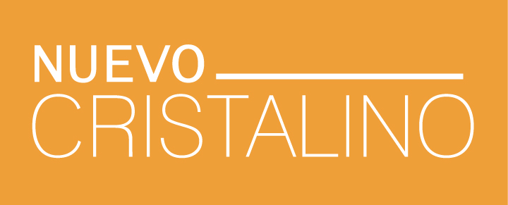

<!-- Improved compatibility of back to top link: See: https://github.com/othneildrew/Best-README-Template/pull/73 -->

<!--
*** Thanks for checking out the Best-README-Template. If you have a suggestion
*** that would make this better, please fork the repo and create a pull request
*** or simply open an issue with the tag "enhancement".
*** Don't forget to give the project a star!
*** Thanks again! Now go create something AMAZING! :D
-->

<!-- PROJECT SHIELDS -->
<!--
*** I'm using markdown "reference style" links for readability.
*** Reference links are enclosed in brackets [ ] instead of parentheses ( ).
*** See the bottom of this document for the declaration of the reference variables
*** for contributors-url, forks-url, etc. This is an optional, concise syntax you may use.
*** https://www.markdownguide.org/basic-syntax/#reference-style-links
-->

[![LinkedIn][linkedin-shield]][linkedin-url]

<!-- PROJECT LOGO -->
 

  

<h3 align="center">Nuevocristalino - Neuelinsen - MyLifeStyleLens</h3>

  

NuevoCristalino-NewLens-Neuelinsen was a comprehensive multisite platform focused on patient education and information about intraocular lenses (IOL). Featuring a question and answer section, a regularly updated blog, and an intuitive IOL and eye clinic browser, it served as an invaluable resource for patients and professionals alike. It spanned across 8 countries and supported 4 languages, ensuring accessibility and relevance on a global scale.
     
    <a href="https://github.com/arturocecilia/nuevocristalino"><strong>Explore the docs »</strong></a>
     
     
    <a href="https://github.com/github_username/repo_name">View Demo</a>
    ·
    <a href="https://github.com/github_username/repo_name/issues/new?labels=bug&template=bug-report---.md">Report Bug</a>
    ·
    <a href="https://github.com/github_username/repo_name/issues/new?labels=enhancement&template=feature-request---.md">Request Feature</a>
  

<!-- TABLE OF CONTENTS -->

  
Table of Contents

  <ol>
    <li>
      <a href="#about-the-project">About The Project</a>
      <ul>
        <li><a href="#built-with">Built With</a></li>
      </ul>
    </li>
    <li>
      <a href="#getting-started">Getting Started</a>
      <ul>
        <li><a href="#prerequisites">Prerequisites</a></li>
        <li><a href="#installation">Installation</a></li>
      </ul>
    </li>
    <li><a href="#usage">Usage</a></li>
    <li><a href="#roadmap">Roadmap</a></li>
    <li><a href="#contributing">Contributing</a></li>
    <li><a href="#license">License</a></li>
    <li><a href="#contact">Contact</a></li>
    <li><a href="#acknowledgments">Acknowledgments</a></li>
  </ol>

<!-- ABOUT THE PROJECT -->

## About The Project

[![Product Name Screen Shot][product-screenshot]](https://example.com)

<a href="#readme-top">back to top</a>

### Built With

- [![Wordpress][Wordpress]][Wordpress-url]
- [![Laravel][Laravel.com]][Laravel-url]
- [![JQuery][JQuery.com]][JQuery-url]

<a href="#readme-top">back to top</a>

<!-- GETTING STARTED -->

## Getting Started

The version used is not up to date but it should work leveraging Wordpress and php backwards compatibility

### Prerequisites

Standard wordpress environment

### Installation

Standard Wordpress installation with the addition of composer packages for running eloquent ORM

<a href="#readme-top">back to top</a>

<!-- USAGE EXAMPLES -->

## Usage

It is a wordpress multisite installation, almost every type of content was editable through the backend and all the translations were centralized. As you may imagine the scripts for the Database are missing, contact me and I will send you a blanked version.

<a href="#readme-top">back to top</a>

<!-- ROADMAP -->

## Contributing

The project is archived, but if you have some sort of similar project in mind (product/service multilingual portal with search and simulation features in jquery) do not hesitate to contact me.

<a href="#readme-top">back to top</a>

<!-- LICENSE -->

## License

Distributed under the MIT License. See `LICENSE.txt` for more information.

<a href="#readme-top">back to top</a>

<!-- CONTACT -->

## Contact

Project Link: [https://github.com/arturocecilia/nuevocristalino](https://github.com/arturocecilia/nuevocristalino)

<a href="#readme-top">back to top</a>

<!-- ACKNOWLEDGMENTS -->

## Acknowledgments

- [msbarrons](https://www.msbarrons.com)

<a href="#readme-top">back to top</a>

<!-- MARKDOWN LINKS & IMAGES -->
<!-- https://www.markdownguide.org/basic-syntax/#reference-style-links -->

[contributors-shield]: https://img.shields.io/github/contributors/github_username/repo_name.svg?style=for-the-badge
[contributors-url]: https://github.com/arturocecilia
[license-shield]: https://img.shields.io/github/license/github_username/repo_name.svg?style=for-the-badge
[license-url]: https://github.com/arturocecilia/nuevocristalino/blob/master/license.txt
[linkedin-shield]: https://img.shields.io/badge/-LinkedIn-black.svg?style=for-the-badge&logo=linkedin&colorB=555
[linkedin-url]: https://www.linkedin.com/in/arturo-cecilia-a4b2bb4b/
[product-screenshot]: screenshot.png
[Wordpress]: https://img.shields.io/badge/WordPress-%23117AC9.svg?style=for-the-badge&logo=WordPress&logoColor=white
[Wordpress-url]: https://wordpress.org/
[Laravel.com]: https://img.shields.io/badge/Laravel-FF2D20?style=for-the-badge&logo=laravel&logoColor=white
[Laravel-url]: https://laravel.com
[JQuery.com]: https://img.shields.io/badge/jQuery-0769AD?style=for-the-badge&logo=jquery&logoColor=white
[JQuery-url]: https://jquery.com
